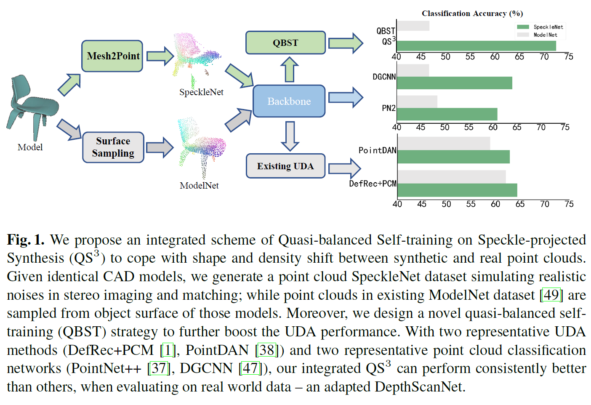
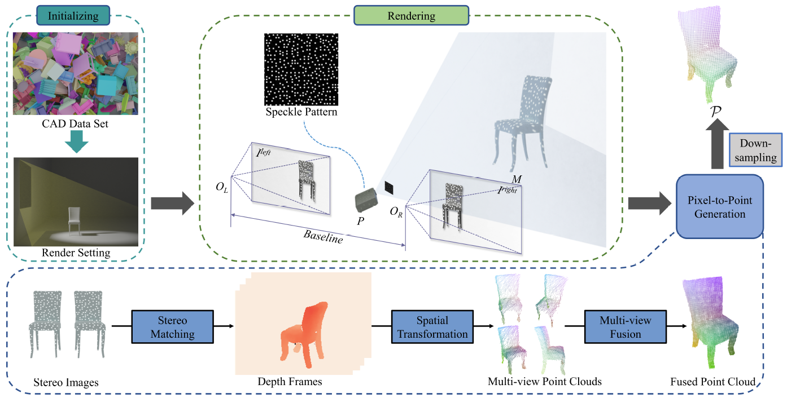

# Quasi-Balanced Self-Training on Noise-Aware Synthesis of Object Point Clouds for Closing Domain Gap

### [Paper](https://arxiv.org/abs/2203.03833) | [Data](https://drive.google.com/drive/folders/1gKLKxGsvAyJo0K4BxDkgBT_r2wk1F5Vm?usp=sharing) | [Supplementary Materials]

<p align="center">
  
</p>

This repository contains an implementation for the ECCV 2022 paper <a href="https://arxiv.org/abs/2203.03833"> Quasi-Balanced Self-Training on Noise-Aware Synthesis of Object Point Clouds for Closing Domain Gap</a>.

This paper introduces an integrated scheme consisting of physically realistic synthesis of object point clouds via rendering stereo images via projection of speckle patterns onto CAD models and a novel quasi-balanced self-training designed for more balanced data distribution by sparsity-driven selection of pseudo labeled samples for long tailed classes.

## Installation Requirments
The code for Mesh2Point pipeline that generates noisy point clouds is compatible with <a href="https://download.blender.org/release/">blender 2.93</a>, which also complile a default python environment. We use our Mesh2Point to scan the ModelNet dataset then get a noisy point cloud dataset--namely SpeckleNet, and the generated datasets are available <a href="https://drive.google.com/drive/folders/1wcERGIKvJRlCbSndM_DCSfcvjiGvv_5g?usp=sharing">here</a> (<a href="https://drive.google.com/file/d/1RX_gridSacIs4xp58zoZ2yTtajEF2kzu/view?usp=sharing">SpeckleNet10</a> for 10 categories and <a href="https://drive.google.com/file/d/1SEyOjtV-2wr1eYWxU6mivOD9NRB2Qz35/view?usp=sharing">SpeckleNet40</a> for 40 categories). 

If you want to scan your own 3D models, please download blender <a href="https://download.blender.org/release/">blender 2.93</a> and install the required python libraries in blender's python environment by running:
```
path_to_blender/blender-2.93.0-linux-x64/2.93/python/bin/pip -r install Mesh2Point_environment.yml
```

Meanwhile, we also release the code for Quasi-Balanced Self-Training (QBST), which is compatible with python <font color="#dd0000">xx</font><br /> and pytorch <font color="#dd0000">xx</font><br />.

You can create an anaconda environment called QBST with the required dependencies by running:
```
conda env create -f QBST_environment.yml
conda activate QBST
```

## Usage
### Data
We use our Mesh2Point pipeline to scan <a href="https://modelnet.cs.princeton.edu/">ModelNet</a> and generate a new dataset <a href="https://drive.google.com/drive/folders/1wcERGIKvJRlCbSndM_DCSfcvjiGvv_5g?usp=sharing">SpeckleNet</a>. Note that blender cannot import ModelNet's original file format, so we convert Object File Format (.off) to Wavefront OBJ Format (.obj). The converted version ModelNet40_OBJ is available <a href="https://drive.google.com/file/d/1WzCYS1HfUKij0hpSzkhfd8uWd2uEP26-/view?usp=sharing">here</a>.

<p align="center">
  
</p>

You can also scan your own 3D model dataset using:
```
CUDA_VISIBLE_DEVICES=0 path_to_blender/blender-2.93.0-linux-x64/blender ./blend_file/spot.blend -b --python scan_models.py --  --view=5 --modelnet_dir=path_to_model_dataset --category_list=bed
```
Notice that you need to organize your own data in the same architecture as ModelNet.

### Ordinary Experiments
We train four ordinary models, specifically, <a href="https://github.com/charlesq34/pointnet2">Ponitnet++</a>, <a href="https://github.com/WangYueFt/dgcnn">DGCNN</a>, <a href="https://github.com/Yochengliu/Relation-Shape-CNN">RSCNN</a> and <a href="https://github.com/princeton-vl/SimpleView">SimpleView</a> on <a href="https://drive.google.com/file/d/1OcPHRtAznBev53PK9sPupNZI1p6-gu2_/view?usp=sharing">ModelNet10 (**M**)</a> and <a href="https://drive.google.com/file/d/1RX_gridSacIs4xp58zoZ2yTtajEF2kzu/view?usp=sharing">SpeckleNet10 (**S**)</a> respectively, and test classification accuracy on <a href="https://drive.google.com/file/d/1gWf5X8HVt0cFpDf-I-lpoqrOBc_kqVL-/view?usp=sharing">DepthScanNet10</a>. The results are shown as following (detailed in our paper): 

<div align="center">
<table><tbody>
<!-- START TABLE -->
<!-- TABLE HEADER -->
<th valign="bottom">Method</th>
<th valign="bottom"><b>M</b> &rarr; D </th>
<th valign="bottom"><b>S</b> &rarr; D</th>
<!-- TABLE BODY -->
<tr><td align="left">PointNet++</td>
<td align="center"><tt>48.4 &pm; 1.3 </tt></td>
<td align="center"><tt><b>60.9 &pm; 0.8</b></tt></td>
</tr>
<tr><td align="left">DGCNN</td>
<td align="center"><tt>46.7 &pm; 1.4</tt></td>
<td align="center"><tt><b>64.0 &pm; 1.0</b></tt></td>
</tr>
<tr><td align="left">RSCNN</td>
<td align="center"><tt>49.7 &pm; 1.1</tt></td>
<td align="center"><tt><b>53.9 &pm; 1.2</b></tt></td>
</tr>
<tr><td align="left">SimpleView</td>
<td align="center"><tt>54.6 &pm; 0.7</tt></td>
<td align="center"><tt><b> 62.3 &pm; 1.3</b></tt></td>
</tbody></table>
</div>


The codes we use for training the ordinary models are from <a href="https://github.com/princeton-vl/SimpleView">SimpleView</a>, please follow the instruction on their github repository to recurrent the results.

### UDA experiments
```
To be done...
```
### Evaluation on ScanNet10 and DepthScanNet10
<a href="https://drive.google.com/file/d/1L2l67Wop1Mvw2yIxufxmm5i82qJKoF7B/view?usp=sharing">ScanNet10</a> is a realistic dataset generated by <a href="https://arxiv.org/abs/1911.02744">PointDAN</a>. It is extracted from a smooth mesh dataset that reconstructed from noisy depth frames. <a href="https://drive.google.com/file/d/1gWf5X8HVt0cFpDf-I-lpoqrOBc_kqVL-/view?usp=sharing">DepthScanNet10</a> is directly extracted from noisy depth frames sequence, which keep more noisy points and therefore more realistic than ScanNet10. Both two datasets use depth frames sequence from <a href="http://www.scan-net.org/">ScanNet</a>. 

If you want to evaluate your models on both realistic datasets, please download <a href="https://drive.google.com/file/d/1L2l67Wop1Mvw2yIxufxmm5i82qJKoF7B/view?usp=sharing">ScanNet10</a> and <a href="https://drive.google.com/file/d/1gWf5X8HVt0cFpDf-I-lpoqrOBc_kqVL-/view?usp=sharing">DepthScanNet10</a>.

##  Acknowledgment
This work is built on some excellent works, thanks for their efforts. If you find them helpful, please consider citing them.
- <a href="https://github.com/charlesq34/pointnet2">Pointnet++</a>
- <a href="https://github.com/Yochengliu/Relation-Shape-CNN">RSCNN</a>
- <a href="https://github.com/WangYueFt/dgcnn">DGCNN</a>
- <a href="https://github.com/princeton-vl/SimpleView">SimpleView</a>
- <a href="https://github.com/IdanAchituve/DefRec_and_PCM">DefRec and PCM</a>
## Citation
If you find our work useful in your research, please consider citing:

        @article{chen2022quasi,
        title={Quasi-Balanced Self-Training on Noise-Aware Synthesis of Object Point Clouds for Closing Domain Gap},
        author={Chen, Yongwei and Wang, Zihao and Zou, Longkun and Chen, Ke and Jia, Kui},
        journal={arXiv preprint arXiv:2203.03833},
        year={2022}
        }

## TODO
- [x] update scannet10 link
- [x] update modelnet_obj link
- [ ] upload QBST code
- [x] upload ordinary code
- [x] generate environment.yml
- [ ] update supplental link
- [x] update ModelNet10 link
